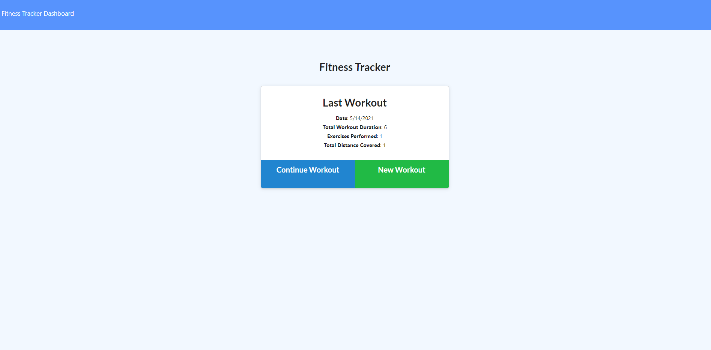

# Workout-Tracker


## Application Picture


## Technologies used 
    -MongoDB
    -Mongoose
    -Javascript

## Summary
    For this application I created a Mongo database with a Mongoose schema and handeled routes with express to connect the back end of the application.


## Code Snippet
    This is the Code Snippet from our Put route in our api routes. This route in particular was allowing us to update an exercise in our workout that we created. 
```
router.put("/workouts/:id", ({ params, body}, res) => {
    Workout.findByIdAndUpdate(
        params.id, 
        {
            $push: {
                exercises: body,
            },
        },
        {
            new: true
        },
    )
        .then(dbWorkout => {
            res.json(dbWorkout);
        })
        .catch(err => {
            res.json(err);
        })
});
```

## Author Links
[LinkedIn](https://www.linkedin.com/in/liamsctewart/)<br>
[Github](https://github.com/LiamStewart8)<br>